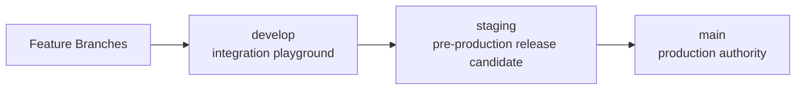

# Branch Topology

## Authority Chain

This repository uses a strict three-branch delivery topology:

1. `develop` is the integration playground.
2. `staging` is the pre-production release-candidate branch.
3. `main` is the production authority branch.

Authority increases only in this direction: `develop` -> `staging` -> `main`.

## Explicit Branch Roles

### `develop` (integration playground)
- Purpose: daily integration, feature work, and fast iteration.
- Production authority: **none**.
- Allowed inbound promotions: feature/fix branches -> `develop`.
- Allowed outbound promotions: `develop` -> `staging`.

### `staging` (pre-production authority)
- Purpose: release-candidate validation against production-like controls.
- Production authority: indirect only (source for production promotion).
- Allowed inbound promotions: `develop` -> `staging`.
- Allowed outbound promotions: `staging` -> `main`.

### `main` (production authority)
- Purpose: production source of truth and deploy authority.
- Production authority: **full**.
- Allowed inbound promotions: `staging` -> `main` only.
- Direct promotion from `develop` to `main`: **forbidden**.

## Promotion-Path Diagram

## Topology Rules

- `main` is production authority only.
- `staging` must be cut directly from the selected `main` baseline before promotion use.
- `develop` must never be treated as production authority.
- Any change to this topology requires a governance doc update and audit evidence.
