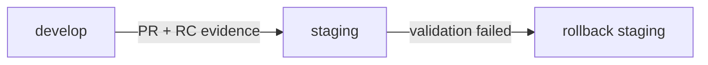

# Develop to Staging Promotion Contract

## Objective

Control promotion from integration branch (`develop`) into pre-production (`staging`) as a release-candidate (RC) event.

## Trigger and Approval Path

1. Create PR with source `develop` and target `staging`.
2. PR must include local validation evidence:
   - `artifacts/controls/local-validation/latest.json`
   - `docker build -f Dockerfile.local-validation -t commons-sim:local-validation .`
3. At least one code-owner approval required.
4. Merge only when RC evidence checklist is complete.

## Release Candidate Evidence Requirements

- Changelog summary of user-visible and model-visible changes.
- Local determinism gate result from `pnpm determinism:check`.
- Scenario validation/benchmark references.
- Residual risk note with owner.
- Rollback readiness note.

Reference checklist: `docs/program/checklists/RC_CHECKLIST.md`.

## Rollback (Failed Staging Candidate)

- If RC fails in staging validation, revert `staging` to previous known-good commit.
- Open incident note with:
  - failed candidate SHA
  - failing checks or scenario outputs
  - rollback SHA and operator
- Re-run local validation against the rollback commit before redeploying staging.

## Promotion Diagram

