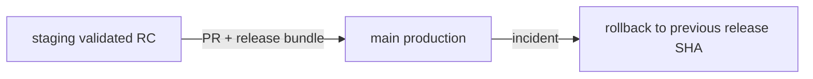

# Staging to Main Release Contract

## Objective

Ensure `main` receives only validated release candidates from `staging`.

## Production Release Gate

1. Create PR with source `staging` and target `main`.
2. PR must pass required checks:
   - `ci / build_test_smoke`
   - `determinism / determinism`
   - `dependency-review / dependency-review`
   - `release-prod / verify_production_release`
3. Require code-owner approval and production approver sign-off.
4. Require release notes and evidence bundle before merge.

## Required Release Bundle

- Release notes from template `docs/program/templates/RELEASE_NOTES_TEMPLATE.md`
- Production approval checklist `docs/program/checklists/PRODUCTION_APPROVAL_CHECKLIST.md`
- Rollback record from `docs/program/templates/ROLLBACK_RECORD_TEMPLATE.md`
- Links to CI/workflow run evidence

## Rollback Contract

- Every production release must have a documented rollback target SHA.
- If production validation fails, revert `main` to rollback SHA and create incident note.
- Record timestamp, operator, and reason in rollback record template.

## Release Diagram

